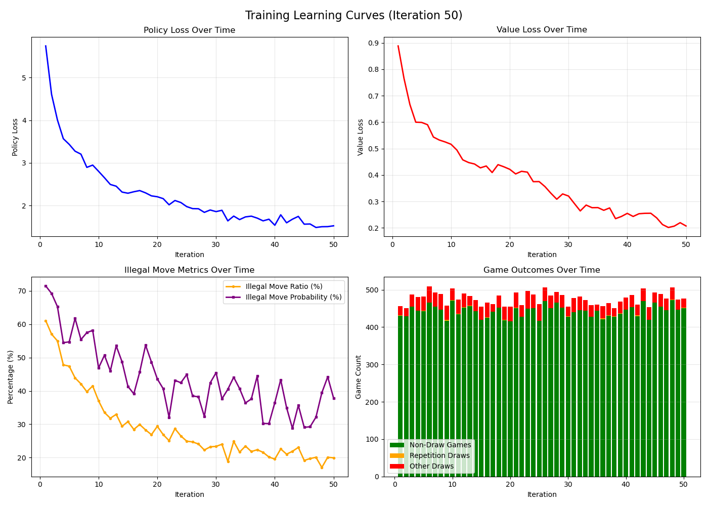
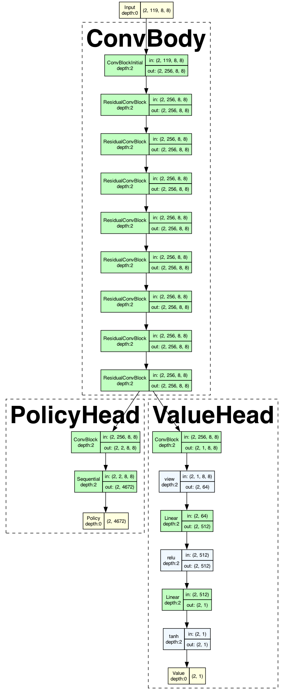

# Chess_AI

A project focused on developing a Chess AI.

## Methodology

This project aims to build a state-of-the-art (SOTA) chess engine by leveraging a combination of advanced techniques:

*   **Deep Reinforcement Learning (Deep RL)**: A neural network learns to evaluate board positions and predict promising moves.
*   **Monte Carlo Tree Search (MCTS)**: Explores the game tree, guided by the neural network's predictions, to select the best move.
*   **Self-Play**: The agent learns and improves by playing games against itself, generating the data needed for training the neural network.
*   **Supervised warmup before RL**: bootstrap policy/value with Lichess puzzles data, then transfer to RL self-play + MCTS fine-tuning using the [Lichess chess-puzzles dataset](https://huggingface.co/datasets/Lichess/chess-puzzles).

This approach, inspired by systems like AlphaZero and Leela Chess Zero, combines the pattern recognition strengths of deep learning with the robust search capabilities of MCTS, enabling the agent to achieve high-level performance through automated learning.

## Crucial Libraries

*   **[`PyTorch`](https://pytorch.org/)**: neural network training, inference, and checkpointing.
*   **[`python-chess`](https://github.com/niklasf/python-chess)**: A pure Python chess library used for representing boards, generating legal moves, parsing move notation (like UCI), and evaluating board states.
*   **[`gymnasium`](https://gymnasium.farama.org/)** (formerly OpenAI Gym): A standard API for reinforcement learning environments. Provides the framework for the AI agent to interact with the chess environment.
*   **[`Hydra`](https://hydra.cc/)** + **[`OmegaConf`](https://omegaconf.readthedocs.io/)**: configuration management for training and experiments.
*   **[`numpy`](https://numpy.org/)**: numerical utilities for data processing and training support code.

Optional:

*   **[`pygame`](https://www.pygame.org/)**: UI/visualization for interactive chess play.
*   **[`rich`](https://rich.readthedocs.io/)**: terminal progress bars and formatted logging.

## Environment

This project utilizes and expands upon the [`chess-gym`](https://github.com/ryanrudes/chess-gym) library to create a custom Gymnasium environment suitable for training the Chess AI agent.

## Training

Run the training pipeline in this order:

1. **Prepare puzzle data (mate-in datasets)**  
   Export, normalize, and augment puzzle positions:
   - `python download/_1_export_lichess_themes.py`
   - `python download/_2_normalize_puzzle_moves.py`
   - `python download/_3_augment_puzzle_json.py`

2. **Supervised pretraining (policy/value initialization)**  
   Train on the prepared puzzle data to bootstrap the network:
   - `python train_supervised.py`

3. **RL fine-tuning with self-play + MCTS**  
   Continue training from the supervised checkpoint using self-play:
   - `python MCTS/train.py`

## Training Performance

### Supervised training (hyperparameter comparison)

| Run | Params | Epochs | Train Loss | Train/Val Acc (%) | Train/Val Acc m1 (%) | Train/Val Acc m2 (%) | Train/Val Acc m3 (%) | Train/Val Acc m4 (%) | Train/Val Acc m5 (%) |
| --- | --- | --- | --- | --- | --- | --- | --- | --- | --- |
| 128ch x 16 layers | 5.5M params | 4 | 0.3134 | 94.34 / 92.76 | 97.47 / 98.39 | 93.22 / 90.98 | 88.07 / 79.73 | 80.86 / 70.60 | 73.05 / 67.85 |
| 128ch x 40 layers | 12.5M params | 4 | 0.3107 | 94.55 / 92.96 | 97.65 / 98.46 | 93.45 / 91.21 | 88.30 / 80.09 | 80.86 / 72.57 | 73.15 / 67.49 |
| 128ch x 40 layers | 12.5M params | 8 | 0.2848 | 95.04 / 93.46 | 98.00 / 98.68 | 94.00 / 91.94 | 89.01 / 80.98 | 81.88 / 72.93 | 74.48 / 67.03 |
| 128ch x 40 layers | 12.5M params | 10 | 0.2806 | 95.12 / 93.03 | 98.06 / 98.65 | 94.10 / 91.50 | 89.16 / 79.04 | 81.94 / 71.39 | 74.92 / 65.12 |

Note: m1/m2/m3/m4/m5 correspond to mate-in-1/2/3/4/5 datasets.

More details: Kaggle training log with [5.5M model](https://www.kaggle.com/code/minseo14/chess-ai-implementation-of-alphazero-chess/log?scriptVersionId=293230986), [12.5M model](https://www.kaggle.com/code/minseo14/chess-ai-implementation-of-alphazero-chess/log?scriptVersionId=293757394)

### RL training (hyperparameter comparison at iter 20/50)

| Run | Params | LR | Drop MAX_MOVES draws | Iter 20 Policy | Iter 20 Value | Iter 20 Illegal Move | Iter 50 Policy | Iter 50 Value | Iter 50 Illegal Move |
| --- | --- | --- | --- | --- | --- | --- | --- | --- | --- |
| 128ch x 40 layers | 12.5M | 1e-4 | No | 2.6177 | 0.3149 | 33.20% | 2.2335 | 0.2551 | 26.02% |
| 128ch x 40 layers | 12.5M | 5e-5 | Yes | 2.2069 | 0.4215 | 29.38% | 1.5257 | 0.2070 | 19.92% |



## Model Information (12.5M)

```
===========================================================================
Layer (type:depth-idx)                             Param #
===========================================================================
ChessNetwork4672                                   --
├─ConvBody: 1-1                                    --
│    └─ConvBlockInitial: 2-1                       --
│    │    └─ModuleList: 3-1                        --
│    │    └─ModuleList: 3-2                        --
│    │    └─Sequential: 3-3                        137,344
│    │    └─BatchNorm2d: 3-4                       256
│    └─ModuleList: 2-2                             --
│    │    └─ResidualConvBlock: 3-5                 295,424
│    │    └─ResidualConvBlock: 3-6                 295,424
│    │    └─ResidualConvBlock: 3-7                 295,424
│    │    └─ResidualConvBlock: 3-8                 295,424
│    │    └─ResidualConvBlock: 3-9                 295,424
│    │    └─ResidualConvBlock: 3-10                295,424
│    │    └─ResidualConvBlock: 3-11                295,424
│    │    └─ResidualConvBlock: 3-12                295,424
│    │    └─ResidualConvBlock: 3-13                295,424
│    │    └─ResidualConvBlock: 3-14                295,424
│    │    └─ResidualConvBlock: 3-15                295,424
│    │    └─ResidualConvBlock: 3-16                295,424
│    │    └─ResidualConvBlock: 3-17                295,424
│    │    └─ResidualConvBlock: 3-18                295,424
│    │    └─ResidualConvBlock: 3-19                295,424
│    │    └─ResidualConvBlock: 3-20                295,424
│    │    └─ResidualConvBlock: 3-21                295,424
│    │    └─ResidualConvBlock: 3-22                295,424
│    │    └─ResidualConvBlock: 3-23                295,424
│    │    └─ResidualConvBlock: 3-24                295,424
│    │    └─ResidualConvBlock: 3-25                295,424
│    │    └─ResidualConvBlock: 3-26                295,424
│    │    └─ResidualConvBlock: 3-27                295,424
│    │    └─ResidualConvBlock: 3-28                295,424
│    │    └─ResidualConvBlock: 3-29                295,424
│    │    └─ResidualConvBlock: 3-30                295,424
│    │    └─ResidualConvBlock: 3-31                295,424
│    │    └─ResidualConvBlock: 3-32                295,424
│    │    └─ResidualConvBlock: 3-33                295,424
│    │    └─ResidualConvBlock: 3-34                295,424
│    │    └─ResidualConvBlock: 3-35                295,424
│    │    └─ResidualConvBlock: 3-36                295,424
│    │    └─ResidualConvBlock: 3-37                295,424
│    │    └─ResidualConvBlock: 3-38                295,424
│    │    └─ResidualConvBlock: 3-39                295,424
│    │    └─ResidualConvBlock: 3-40                295,424
│    │    └─ResidualConvBlock: 3-41                295,424
│    │    └─ResidualConvBlock: 3-42                295,424
│    │    └─ResidualConvBlock: 3-43                295,424
│    │    └─ResidualConvBlock: 3-44                295,424
├─PolicyHead: 1-2                                  --
│    └─ConvBlock: 2-3                              --
│    │    └─Conv2d: 3-45                           256
│    │    └─BatchNorm2d: 3-46                      4
│    └─Sequential: 2-4                             --
│    │    └─Flatten: 3-47                          --
│    │    └─Linear: 3-48                           602,688
├─ValueHead: 1-3                                   --
│    └─ConvBlock: 2-5                              --
│    │    └─Conv2d: 3-49                           128
│    │    └─BatchNorm2d: 3-50                      2
│    └─Linear: 2-6                                 33,280
│    └─Linear: 2-7                                 513
===========================================================================
Total params: 12,591,431
Trainable params: 12,591,431
Non-trainable params: 0
===========================================================================
```

## Key Training & Executables

Other runnable entry points:

*   **`chess_pygame/main.py`**: pygame-based UI for interactive play/visualization.
*   **`tutorials/human_vs_ai.py`**: play against the current model from the command line.
*   **`test/diagnostic_*.py`**: diagnostics for legality, draw detection, replay buffer, and mate-in-one sanity checks.
*   **`test/replay_history.py`**: inspect and validate saved game histories.
*   **`utils/visualize_learning_curves.py`**: plot training curves from saved metrics.

Model visualization:

*   **`MCTS/models/network_4672.py`**: model definition used for graph visualization with [`torchview_custom`](https://github.com/star14ms/torchview_custom).

Example visualization outputs (gitignored paths, add manually if needed):



